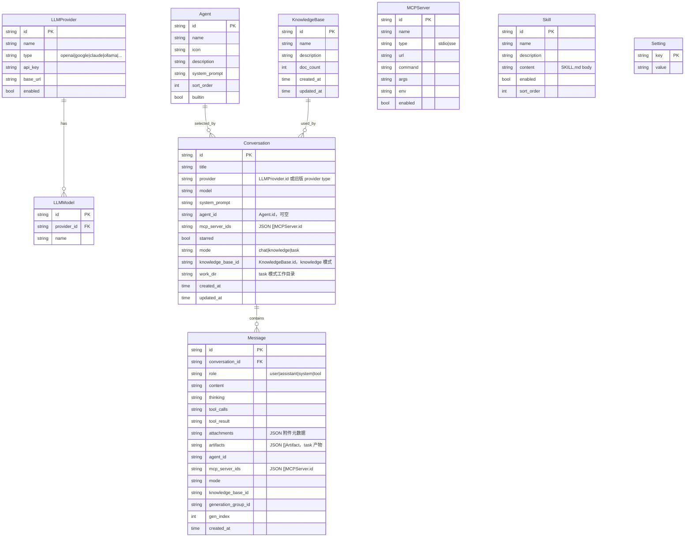
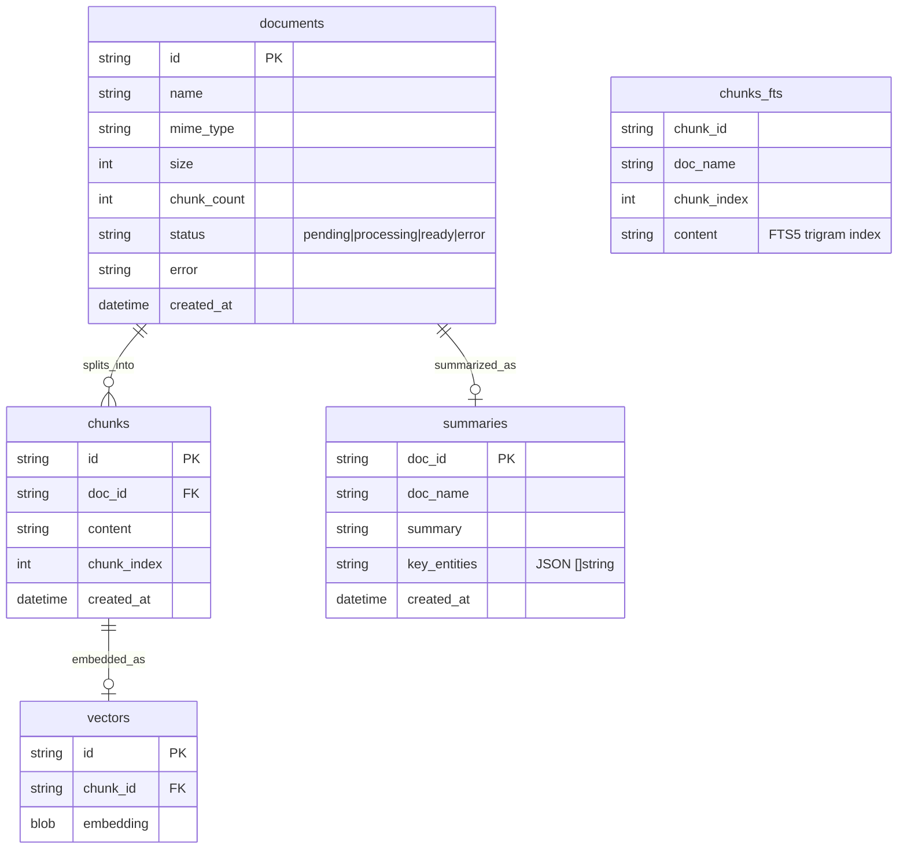

# Wails AI Chat — 产品规格说明书

> 版本: v0.4 | 更新: 2026-06-05

---

## 〇、三种对话模式（重要：机制不同）

Light 有三种对话模式，**底层执行机制完全不同**，务必区分：

| 模式 | 中文 | 执行引擎 | 说明 |
|------|------|----------|------|
| `chat` | 问答 | 手写 `runToolLoop` | 普通对话，可挂 MCP/skill/web search |
| `knowledge` | 知识库 | 手写 `runToolLoop`（强制挂 `search_knowledge`） | 知识库问答，与问答共用循环 |
| `task` | **任务** | **eino 框架 ReAct Agent** | 自主任务执行，机制独立，详见专门文档 |

> ⚠️ **问答 / 知识库** 共用同一套手写 tool 循环（`internal/handler/chat.go:584`），区别仅在知识库模式强制绑定 `search_knowledge` 工具。
>
> ⚠️ **任务模式** 是完全不同的引擎——标准 eino ReAct Agent，循环/工具注入/Observation 回灌全由框架负责。**不要与前两者混为一谈。**

📖 **任务模式 ReAct 架构详解（含数据流图、我们的流式改动、与问答/知识库对比）**：
见 [`docs/superpowers/specs/2026-06-04-task-react-architecture.md`](superpowers/specs/2026-06-04-task-react-architecture.md)

📖 **任务模式功能设计（工具集、bash 安全、前端组件）**：
见 [`docs/superpowers/specs/2026-06-03-task-mode-design.md`](superpowers/specs/2026-06-03-task-mode-design.md)

---

## 一、项目概述

基于 Wails v2 + Vue 3 + Go 的桌面 AI 聊天客户端。目标是一个可扩展的本地 AI 工作台，支持多供应商模型、MCP 工具调用、Skills 技能广场。

---

## 二、已完成功能（M1-M2）

- [x] 多供应商对话（OpenAI / Claude / Ollama）
- [x] 流式输出 + 打字机效果
- [x] Markdown 渲染 + 代码高亮（highlight.js）
- [x] 设置弹窗（API Key / Base URL / 默认供应商）
- [x] 对话列表 CRUD + 搜索
- [x] Skills 技能预设（system prompt 注入）
- [x] 停止生成按钮
- [x] 自动滚动到底部

---

## 三、Eino-ext 可用组件清单

> 来源: https://github.com/cloudwego/eino-ext

### 3.1 ChatModel（对话模型）

| 供应商 | 包路径 | 关键配置 |
|--------|--------|---------|
| OpenAI / 兼容 | `components/model/openai` | APIKey, Model, BaseURL, Temperature |
| DeepSeek | `components/model/deepseek` | APIKey, Model, BaseURL |
| Claude | `components/model/claude` | APIKey, Model, BaseURL |
| Gemini | `components/model/gemini` | APIKey, Model |
| Qwen（通义） | `components/model/qwen` | APIKey, Model |
| Ark（火山） | `components/model/ark` | APIKey, Model, Region |
| Qianfan（文心） | `components/model/qianfan` | APIKey, SecretKey, Model |
| OpenRouter | `components/model/openrouter` | APIKey, Model |
| Ollama（本地） | `components/model/ollama` | BaseURL, Model |

**所有模型均实现 `ToolCallingChatModel` 接口**，支持 `Generate()` / `Stream()` / `BindTools()`。

### 3.2 Tools（工具）

| 工具 | 包路径 | 说明 | 关键配置 |
|------|--------|------|---------|
| MCP | `components/tool/mcp` | 接入任意 MCP Server | Cli(MCPClient), ToolNameList |
| MCP Official | `components/tool/mcp/officialmcp` | 官方 SDK 版本 | Cli(*mcp.ClientSession) |
| DuckDuckGo | `components/tool/duckduckgo` | 免费搜索 | Region, MaxResults |
| Google Search | `components/tool/googlesearch` | 付费搜索 | APIKey, SearchEngineID |
| Bing Search | `components/tool/bingsearch` | 付费搜索 | APIKey, Region |
| SearXNG | `components/tool/searxng` | 自托管聚合搜索 | BaseUrl, Engines |
| Wikipedia | `components/tool/wikipedia` | 百科知识 | Language, TopK |
| HTTP GET | `components/tool/httprequest/get` | HTTP 请求 | Headers |
| HTTP POST | `components/tool/httprequest/post` | HTTP 请求 | Headers |
| CommandLine | `components/tool/commandline` | 代码执行（需 Docker） | Operator(sandbox) |
| BrowserUse | `components/tool/browseruse` | 浏览器自动化 | - |
| SequentialThinking | `components/tool/sequentialthinking` | 顺序思考 | - |

### 3.3 MCP 接入方式

```go
// SSE 方式（HTTP 服务器）
cli, _ := client.NewSSEMCPClient("http://localhost:3000/sse")
cli.Start(ctx)
cli.Initialize(ctx, mcp.InitializeRequest{...})
tools, _ := mcpTool.GetTools(ctx, &mcpTool.Config{Cli: cli})

// Stdio 方式（本地进程）
// 使用 mark3labs/mcp-go 的 StdioMCPClient
cli, _ := client.NewStdioMCPClient("npx", []string{"-y", "@modelcontextprotocol/server-filesystem", "/"})
```

---

## 四、待实现功能规划（M3）

### 4.1 设置弹窗重构（三 Tab）

**Tab 1: 模型供应商**
- 现有内容迁移
- 新增供应商支持：DeepSeek、Gemini、Qwen、Ark
- 每个供应商：API Key + Base URL + 默认模型

**Tab 2: Skills 广场**
- 内置预设技能（代码专家、写作助手等）
- 自定义技能：用户粘贴/编辑 SKILL.md 格式内容
- 技能存储在 SQLite `skills` 表
- 技能绑定到对话（对话创建时选择）

**Tab 3: MCP 配置**
- 添加/删除 MCP 服务器
- 支持两种连接类型：
  - SSE：填写 URL（如 `http://localhost:3000/sse`）
  - Stdio：填写命令（如 `npx -y @modelcontextprotocol/server-filesystem /`）
- 每个服务器可启用/禁用
- 连接测试按钮（列出可用工具）
- 存储在 SQLite `mcp_servers` 表

### 4.2 MCP 工具调用链路

```
用户发消息
  → 后端读取启用的 MCP 服务器配置
  → 连接 MCP 服务器（SSE/Stdio）
  → GetTools() 获取工具列表
  → llm.BindTools(tools)
  → llm.Stream(messages)
  → 如果返回 tool_call：
      → 执行工具 tool.InvokableRun()
      → 将结果作为 tool message 追加
      → 继续 llm.Stream()（循环直到无 tool_call）
  → 流式输出最终回复
```

**工具调用在流式输出中的展示：**
- 工具调用时显示 `🔧 调用工具: xxx` 的中间状态
- 工具结果折叠显示

### 4.3 更多供应商支持

在 `internal/eino/chat.go` 的 `Configure()` 中新增：
- `deepseek` → `components/model/deepseek`
- `gemini` → `components/model/gemini`
- `qwen` → `components/model/qwen`
- `ark` → `components/model/ark`

### 4.4 对话标题自动生成

- 第一条消息发送后，异步调用 LLM 生成 5 字以内的标题
- 更新 `conversations.title` 并通过事件通知前端刷新

### 4.5 Skills 广场（M3 简化版）

Skills 定义（参考 Claude Code SKILL.md 格式）：
```
name: 代码专家
description: 专注于代码编写、审查和优化
system_prompt: You are an expert programmer...
icon: 💻
category: 开发
```

存储在 `skills` 表，对话创建时可选择绑定一个 Skill。

---

## 五、数据库实体关系（ER）

Light 使用两层 SQLite 存储：主库 `~/.wails-chat/chat.db` 保存对话、配置、知识库元数据；每个知识库独立使用 `~/.wails-chat/knowledgebases/{id}/kb.db` 保存文档、分块、FTS5 索引和向量。

### 5.1 主库 `chat.db`



主库关系说明：

- `Conversation.provider` 当前保存 provider 标识；旧数据可能保存 provider type，加载时做兼容迁移。
- `Conversation.mcp_server_ids` 与 `Message.mcp_server_ids` 是 JSON 数组，不是独立关联表。
- `Message.attachments` 保存用户上传附件元数据，不保存大文件内容。
- `Message.artifacts` 保存 task 模式结构化产物数组，包含 `type:"plan"` 与 `type:"file"` 等；plan 是执行计划产物，不是文件。
- `Skill` 是全局技能广场数据；对话引用技能时走 prompt 注入逻辑，目前没有单独的 conversation-skill 关联表。

### 5.2 每个知识库的 `kb.db`



知识库关系说明：

- `KnowledgeBase` 只在主库保存元数据；实际文档索引数据在独立 `kb.db` 中。
- `chunks_fts` 是 FTS5 虚拟表，不是普通实体表；由 `chunks` 同步写入或重建。
- 删除文档时必须删除 `chunks`、`vectors`、`summaries` 和 FTS5 记录，保持局部一致性。

### 5.3 Task Artifact 分桶规则

task 模式历史消息恢复时，`Message.artifacts` 必须按 `type` 显式分桶：

| Artifact type | UI 区域 | 说明 |
|---------------|---------|------|
| `plan` | 回复顶部「执行计划」卡片 | 独立计划产物，历史和实时渲染一致 |
| `file` | 「本次涉及的文件」区域 | 仅文件读写产物进入文件区 |
| `url` / `image` / 其他 | 预留「相关产物」区域 | 不得混入文件区 |

关键约束：`fileArtifacts` 不能使用 `type !== 'plan'` 这种负向分类；必须使用 `type === 'file'`，否则 plan 或未来新类型会被错误显示为文件。

---

## 六、Go 依赖新增

```
github.com/cloudwego/eino-ext/components/tool/mcp@latest
github.com/cloudwego/eino-ext/components/model/deepseek@latest
github.com/cloudwego/eino-ext/components/model/gemini@latest
github.com/cloudwego/eino-ext/components/model/qwen@latest
github.com/cloudwego/eino-ext/components/model/ark@latest
github.com/mark3labs/mcp-go@latest
```

---

## 七、实现优先级

| 优先级 | 功能 | 复杂度 |
|--------|------|--------|
| P0 | 设置弹窗三 Tab 重构 | 低 |
| P0 | 更多供应商（DeepSeek/Gemini/Qwen） | 低 |
| P0 | 对话标题自动生成 | 低 |
| P1 | MCP 配置 UI + 存储 | 中 |
| P1 | MCP 工具调用链路 | 高 |
| P2 | Skills 广场（自定义） | 中 |
| P3 | RAG / 向量检索 | 高 |

---

## 八、技术约束

- Wails v2：Go handler 不能有 `context.Context` 参数（已修复）
- 流式输出通过 `runtime.EventsEmit` 传递，不能直接返回 stream
- MCP 连接需要在后台 goroutine 维护，不能阻塞 UI
- SQLite 单文件，所有配置本地存储
